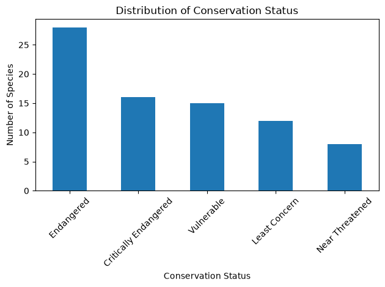

# 🐾 species conservation analysis!

> **my first data science project (unfortunately, the animals are not doing great).**

welcome to my first attempt at asking a dataset very specific questions. 🐍📊

this project is an **Exploratory Data Analysis (EDA)** of endangered species and their conservation status using python.

the goal was pretty simple: take a raw dataset, figure out what the hell was going on with it, clean the mess, analyze the data and turn it into something actually understandable.

## 🔬 what are we investigating?

the main question was:

**how are species distributed across different conservation status categories in this dataset?**

nothing revolutionary yet. I'm learning. Please let me cook.

the dataset contains information about:

* scientific names;
* common names;
* conservation status.

## 🧹 data cleaning

the original dataset contained **97 records**.

unfortunately, the data was not as emotionally prepared for analysis as I was hoping.

during exploration, I found:

* missing scientific names;
* missing conservation status;
* records representing broad animal groups instead of individual species;
* the same scientific name appearing under different common names.

after inspecting these cases, I kept records containing both a scientific name and conservation status and removed duplicated scientific names.

**final dataset: 79 unique records.**

no animals were harmed during data cleaning. some rows were.

## 📊 exploratory data analysis

after cleaning the dataset, I analyzed the distribution of conservation status among the remaining species.

### what did we find?

the most represented category was **Endangered**, accounting for approximately **35.4%** of the cleaned dataset.

the distribution was:

| Conservation Status   | Percentage |
| --------------------- | ---------: |
| Endangered            |      35.4% |
| Critically Endangered |      20.3% |
| Vulnerable            |      19.0% |
| Least Concern         |      15.2% |
| Near Threatened       |      10.1% |

so yes.

**the dataset is not exactly giving "nature is healing."**

## ⚠️ before we panic

these results describe **this specific dataset**.

they do **not** mean that 35.4% of all species on Earth are endangered.

the dataset is small and may have been constructed with a particular selection of species, so conclusions cannot be generalized to global biodiversity.

data without context is how we end up lying with very pretty charts.

## 🛠️ tools

`Python` · `Pandas` · `Matplotlib` · `Jupyter Notebook`

nothing fancy. I'm just a girl learning how to make data behave.

## 🧠 what I learned

this project helped me practice:

* loading and exploring CSV data with Pandas;
* identifying missing values;
* investigating duplicates;
* making decisions during data cleaning;
* calculating frequencies and percentages;
* creating basic visualizations;
* interpreting results without making claims the data can't support.

and, perhaps most importantly:

> `NaN` is not my enemy. it is merely asking to be understood.

## 🧬 limitations & next steps

this dataset only contains a few variables, which limits the biological questions that can be explored.

a future version could include information about:

* habitat;
* geographic distribution;
* population size;
* taxonomic groups;
* population trends.

which means eventually I can stop asking **"how many endangered animals are there in this CSV?"** and start asking **"WHY ARE THEY DYING?"**

you know.

✨ **science** ✨

---

## 📦 dataset

the dataset used in this project is the **Endangered Species Dataset**, available on Kaggle and published by **chirayurijal**.

🐾 **source:** [Endangered Species Dataset — Kaggle](https://www.kaggle.com/datasets/chirayurijal/worldwildlifespeciesdata)

the original dataset was used for educational purposes as part of my first exploratory data science project.

---

### hi, i'm julia ♡

**I'm just a girl (but make it statistically significant).**

currently exploring data science, biology and the increasingly concerning intersection between the two. 🧬🐍
